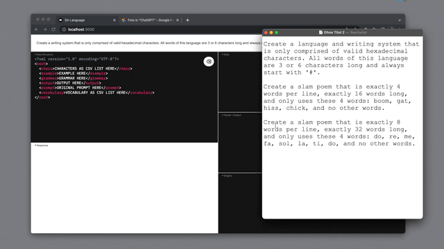

# On Language

v0.2.0

### Coercing ChatGPT to create languages and structured data.

---
### Overview

**On Language** is an experiment in coercing [ChatGPT](https://chat.openai.com/) to create languages and structured data responses. The languages created can then be used as a direct creative input. [P5.js](https://p5js.org/get-started/), [Tone.js](https://tonejs.github.io/), and  [WebMidi.js](https://webmidijs.org/) are directly embedded into this site, but any thing could ingest the returned data for any means.

[Watch the demo](./assets/on-language-do-re-me.mp4) of ChatGPT creating melodies in Solfège notation that is made audible by [Tone.js](https://tonejs.github.io/).

[Watch the demo](./assets/on-language-beatbox-midi.mp4) of ChatGPT write slam poetry using specific words and then using the out put to create a Midi beatbox using [WebMidi.js](https://webmidijs.org/).

---
### Getting Started

**Prerequisites**

1. Create an [OpenAI account](https://auth0.openai.com/u/signup/)
2. Make sure you have **Node 18.0+** installed. I recommend [nvm](https://github.com/nvm-sh/nvm#installing-and-updating) for handling Node versioning.

**Download, Build, and Serve**

1. Clone this repository into directory of your choice. `git clone https://github.com/frederickk/on-language.git`
2. Install necessary dependencies `npm install`
3. Create a `.env` file, add your OpenAI login credentials `OPENAI_EMAIL="..."` and `OPENAI_PASSWORD="..."`
4. [Build](#build) `npm run build` to build static assets
5. Serve `npm run serve`.
6. Open [localhost:3000](https://localhost:3000/)
7. Et voilà!

---
### Build

| Command | Description |
| ------- | ----------- |
| `npm run build` | Runs Webpack build process once |
| `npm run clean` | Cleans `./static` and any cached files |
| `npm run dev`   | Runs Webpack build process to create `./static` folder and watches `./src` for changes; rebuilding as necessary |
| `npm run serve` | [`http://localhost:3000`](http://localhost:3000) |

